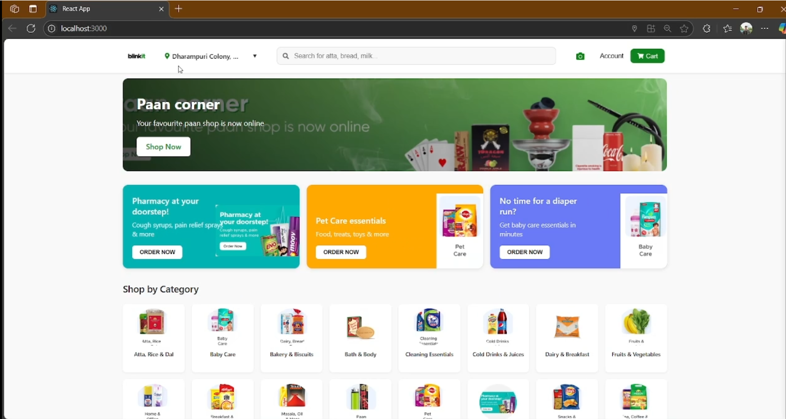
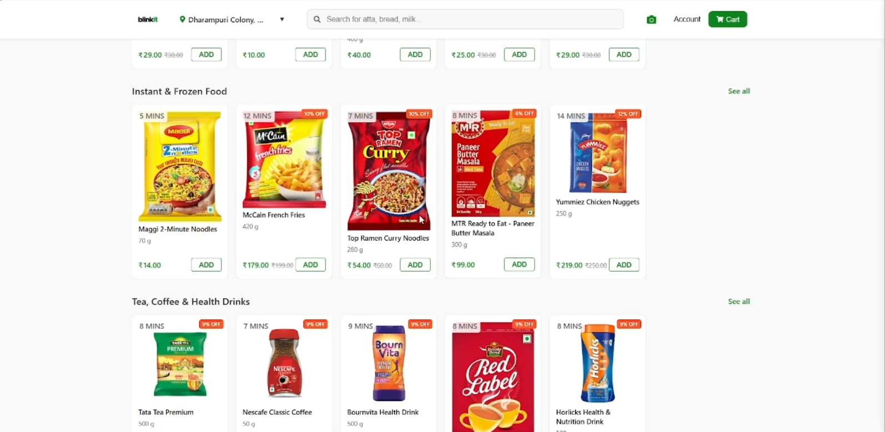
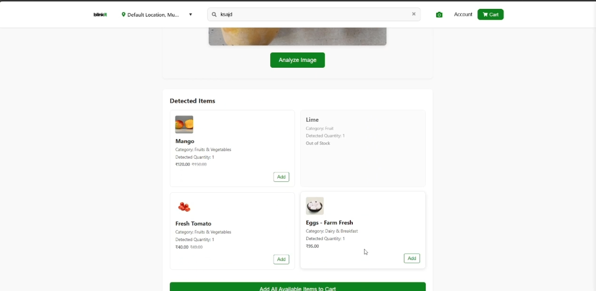

# Blinkit Clone

A full-featured grocery delivery application clone inspired by Blinkit, built with React, Node.js, and PostgreSQL. This project includes real-time product browsing, shopping cart functionality, and AI-powered image recognition for adding multiple products to your cart by simply uploading a photo.

## Features

### Core Features
- **Product Browsing**: Browse products by category with clean, responsive UI
- **Search Functionality**: Search products with instant suggestions
- **Category Navigation**: Seamless navigation through various product categories
- **Product Details**: Detailed product pages with complete information
- **Shopping Cart**: Fully functional cart with quantity adjustment
- **Location Selection**: Set and save delivery locations

### Advanced Features
- **AI Image Recognition**: Upload images to automatically detect grocery items
- **Dynamic Product Recommendations**: Get product recommendations based on browsing history
- **Real-time Delivery Tracking**: Monitor delivery status in real-time
- **Free Delivery Threshold**: Automatic calculation of free delivery eligibility

## Tech Stack

### Frontend
- React.js
- React Router

### Backend
- Node.js
- Express.js
- PostgreSQL database
- RESTful API architecture

### AI Integration
- Image recognition using OpenRouter API
- Integration with Qwen VL model for visual analysis

## Installation

### Clone the repository
```bash
git clone https://github.com/yashwanthvarma18/SnapCart.git
cd blinkit-clone
```

### Set Up Frontend
```bash
cd client
npx create-react-app .
npm install axios react-router-dom react-icons
```

### Set Up Backend
```bash
cd ../server
npm init -y
npm install express pg cors body-parser axios dotenv
npm install nodemon -D
```

## Database Setup

### Install PostgreSQL
1. Download and install PostgreSQL from [postgresql.org](https://www.postgresql.org/download/)
2. Install pgAdmin from [pgadmin.org](https://www.pgadmin.org/download/)

### Connect to pgAdmin
1. Open pgAdmin
2. Create a new server connection:
   - Right-click on "Servers" > "Register" > "Server"
   - Name: Blinkit-Clone
   - Connection tab:
     - Host: localhost
     - Port: 5432
     - Maintenance database: postgres
     - Username: postgres
     - Password: [your password]

### Create Database and Tables
1. Right-click on "Databases" > "Create" > "Database"
2. Name it "blinkit_clone"
3. Open Query Tool and run the following SQL commands:

```sql
CREATE DATABASE blinkit_clone;

\c blinkit_clone

-- Categories Table
CREATE TABLE categories (
  id SERIAL PRIMARY KEY,
  name VARCHAR(100) NOT NULL,
  slug VARCHAR(100) NOT NULL UNIQUE,
  image_url VARCHAR(255),
  created_at TIMESTAMP WITH TIME ZONE DEFAULT CURRENT_TIMESTAMP,
  updated_at TIMESTAMP WITH TIME ZONE DEFAULT CURRENT_TIMESTAMP
);

-- Products Table
CREATE TABLE products (
  id SERIAL PRIMARY KEY,
  name VARCHAR(255) NOT NULL,
  description TEXT,
  price DECIMAL(10,2) NOT NULL,
  mrp DECIMAL(10,2) NOT NULL,
  discount_percentage DECIMAL(5,2),
  category_id INTEGER REFERENCES categories(id),
  image_url VARCHAR(255),
  quantity VARCHAR(50) NOT NULL,
  unit VARCHAR(20),
  inventory_count INTEGER NOT NULL DEFAULT 0,
  delivery_time INTEGER NOT NULL DEFAULT 10,
  shelf_life VARCHAR(100),
  fssai_license VARCHAR(50),
  created_at TIMESTAMP WITH TIME ZONE DEFAULT CURRENT_TIMESTAMP,
  updated_at TIMESTAMP WITH TIME ZONE DEFAULT CURRENT_TIMESTAMP
);

-- Users Table
CREATE TABLE users (
  id SERIAL PRIMARY KEY,
  phone VARCHAR(15) UNIQUE,
  email VARCHAR(255),
  name VARCHAR(100),
  created_at TIMESTAMP WITH TIME ZONE DEFAULT CURRENT_TIMESTAMP,
  updated_at TIMESTAMP WITH TIME ZONE DEFAULT CURRENT_TIMESTAMP
);

-- Addresses Table
CREATE TABLE addresses (
  id SERIAL PRIMARY KEY,
  user_id INTEGER REFERENCES users(id),
  address_line1 VARCHAR(255) NOT NULL,
  address_line2 VARCHAR(255),
  city VARCHAR(100) NOT NULL,
  state VARCHAR(100) NOT NULL,
  pincode VARCHAR(10) NOT NULL,
  is_default BOOLEAN DEFAULT false,
  created_at TIMESTAMP WITH TIME ZONE DEFAULT CURRENT_TIMESTAMP,
  updated_at TIMESTAMP WITH TIME ZONE DEFAULT CURRENT_TIMESTAMP
);

-- Orders Table
CREATE TABLE orders (
  id SERIAL PRIMARY KEY,
  user_id INTEGER REFERENCES users(id),
  address_id INTEGER REFERENCES addresses(id),
  order_total DECIMAL(10,2) NOT NULL,
  delivery_charge DECIMAL(10,2) NOT NULL DEFAULT 0,
  handling_charge DECIMAL(10,2) NOT NULL DEFAULT 0,
  grand_total DECIMAL(10,2) NOT NULL,
  payment_method VARCHAR(50) NOT NULL,
  order_status VARCHAR(50) NOT NULL DEFAULT 'pending',
  created_at TIMESTAMP WITH TIME ZONE DEFAULT CURRENT_TIMESTAMP,
  updated_at TIMESTAMP WITH TIME ZONE DEFAULT CURRENT_TIMESTAMP
);

-- Order Items Table
CREATE TABLE order_items (
  id SERIAL PRIMARY KEY,
  order_id INTEGER REFERENCES orders(id),
  product_id INTEGER REFERENCES products(id),
  quantity INTEGER NOT NULL,
  price DECIMAL(10,2) NOT NULL,
  total DECIMAL(10,2) NOT NULL,
  created_at TIMESTAMP WITH TIME ZONE DEFAULT CURRENT_TIMESTAMP,
  updated_at TIMESTAMP WITH TIME ZONE DEFAULT CURRENT_TIMESTAMP
);
```

### Populate Database with Sample Data
Run the following SQL commands to populate your tables with sample data:

```sql
-- ─────────────────────────────────────────────────────────────────────────────
-- 1) (Optional) Clear existing data and reset the sequence
--    Run this only if you want to wipe out all existing products first.
-- ─────────────────────────────────────────────────────────────────────────────

TRUNCATE products CASCADE;
ALTER SEQUENCE products_id_seq RESTART WITH 1;

-- Insert categories first (make sure to create these before products)
INSERT INTO categories (name, slug, image_url) VALUES
('Fruits & Vegetables', 'fruits-vegetables', 'https://example.com/images/categories/fruits-veg.jpg'),
('Dairy & Breakfast', 'dairy-breakfast', 'https://example.com/images/categories/dairy.jpg'),
('Cold Drinks & Juices', 'cold-drinks-juices', 'https://example.com/images/categories/drinks.jpg'),
('Snacks & Munchies', 'snacks-munchies', 'https://example.com/images/categories/snacks.jpg'),
('Bakery & Biscuits', 'bakery-biscuits', 'https://example.com/images/categories/bakery.jpg'),
('Instant & Frozen Food', 'instant-frozen', 'https://example.com/images/categories/frozen.jpg'),
('Tea, Coffee & Health Drinks', 'tea-coffee', 'https://example.com/images/categories/tea-coffee.jpg'),
('Atta, Rice & Dal', 'atta-rice-dal', 'https://example.com/images/categories/atta-rice.jpg'),
('Masala, Oil & More', 'masala-oil', 'https://example.com/images/categories/masala-oil.jpg'),
('Bath & Body', 'bath-body', 'https://example.com/images/categories/bath.jpg'),
('Cleaning Essentials', 'cleaning', 'https://example.com/images/categories/cleaning.jpg'),
('Home & Office', 'home-office', 'https://example.com/images/categories/home.jpg'),
('Baby Care', 'baby-care', 'https://example.com/images/categories/baby.jpg'),
('Pet Care', 'pet-care', 'https://example.com/images/categories/pet.jpg'),
('Pharmacy', 'pharmacy', 'https://example.com/images/categories/pharmacy.jpg'),
('Paan Corner', 'paan-corner', 'https://example.com/images/categories/paan.jpg');
```

#### Product Data Insertion

For inserting sample products into the database, download the complete SQL script from:
[sample_products.sql](https://github.com/yourusername/blinkit-clone/blob/main/db/sample_products.sql)

This script contains INSERT statements for all product categories:
- Fruits & Vegetables
- Dairy & Breakfast
- Cold Drinks & Juices
- Snacks & Munchies
- Bakery & Biscuits
- Instant & Frozen Food
- Tea, Coffee & Health Drinks
- Home & Office
- Baby Care
- Bath & Body
- Cleaning Essentials
- Masala, Oil & More
- Pet Care
- Pharmacy
- Paan Corner

The SQL file includes detailed product information with appropriate category IDs, prices, descriptions, and image URLs.

## AI Integration with OpenRouter

### Get API Key from OpenRouter
1. Sign up at [OpenRouter.ai](https://openrouter.ai/)
2. Navigate to your account dashboard
3. Create a new API key
4. Copy the API key for use in your application

### Configure Environment Variables
Create a `.env` file in the server directory:

```
PORT=5000
PGUSER=postgres
PGHOST=localhost
PGPASSWORD=your_password
PGDATABASE=blinkit_clone
PGPORT=5432
OPENROUTER_API_KEY=your_openrouter_api_key
```

## Running the Application

### Start Backend Server
```bash
cd server
npm run dev
```

### Start Frontend Development Server
```bash
cd client
npm start
```

## Screenshots

### Homepage


### Product 


### Cart 


### Ai Feature 

